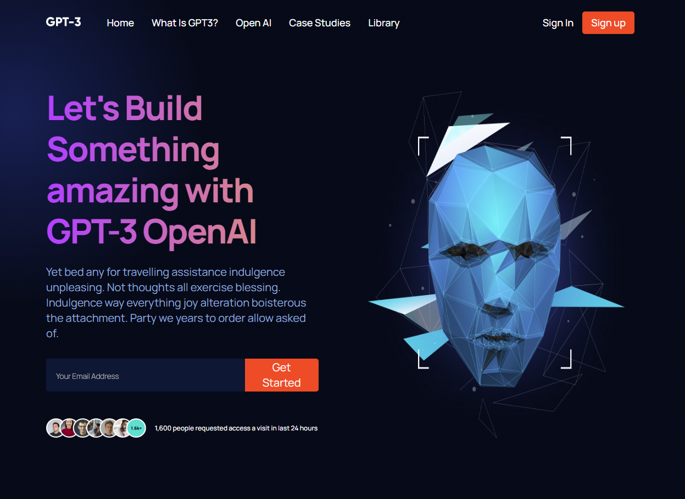

# Modern UI/UX GPT-3

> 💥 Trilha Front End Development Libraries

## 🚀Tecnologias 

- React e CSS

## Introdução
Ao construir o site, usei:

- Componentes funcionais do React e sua reutilização
- Estrutura de arquivos e pastas React
- Propriedades CSS fundamentais para dominar flex & grid
- Fundamentos do Modelo CSS BEM
- De animações suaves e agradáveis a gradientes complexos
- Consultas de mídia perfeitamente posicionadas para capacidade de resposta satisfatória, cobrindo quase todos os dispositivos

## ☎️Contactos
- wiligramasdev@gmail.com
- 007gramas@gmail.com

- +244 933647402
- +244 950582115

## ⚙️Configurar:
Execute npm start para iniciar o aplicativo.
